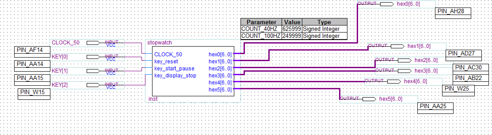

# 实验报告
## 1. 实验内容和任务：
1. 运用 Verilog 硬件描述语言，基于 DE1-SOC 实验板，设计实现一个具有较多
功能的计时秒表。
2. 要求将 6 个数码管设计为具有“分：秒：毫秒”显示，按键的控制动作有：
“计时复位”、“计数/暂停”、“显示暂停/显示继续”等。功能能够满足马拉
松或长跑运动员的计时需要。
3. 利用示波器观察按键的抖动，设计按键电路的消抖方法。
4. 在实验报告中详细报告自己的设计过程、步骤及 Verilog 代码。

## 2. 实验电路

&emsp;&emsp;stopwatch模块参考了实验指导第17页上的电路，并加入了两个消抖模块，对key_start_pause和key_display_stop进行消抖

## 3. 我的设计
&emsp;&emsp;我的设计分为三个模块，sevenseg、stopwatch、eliminate_jitter
+ Sevenseg模块和书上一样负责显示管的显示转换
+ stopwatch模块转化一个100hz的时钟信号用以秒表计时，转化一个40hz信号用于消抖模块的时钟，秒表本身是一个6位的加法器，其中毫秒低位，毫秒高位，秒低位，分低位是十进制加法器，其余为6进制加法器
+ Eliminate_jitter模块负责消抖，每个40hz时钟的上升沿采集一次按键电平，记录下本次采集结果，并输出之前两次采集结果的或

