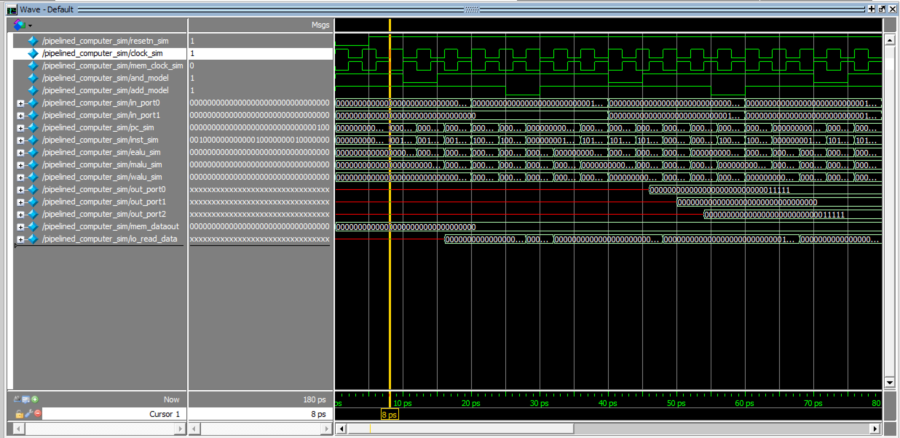
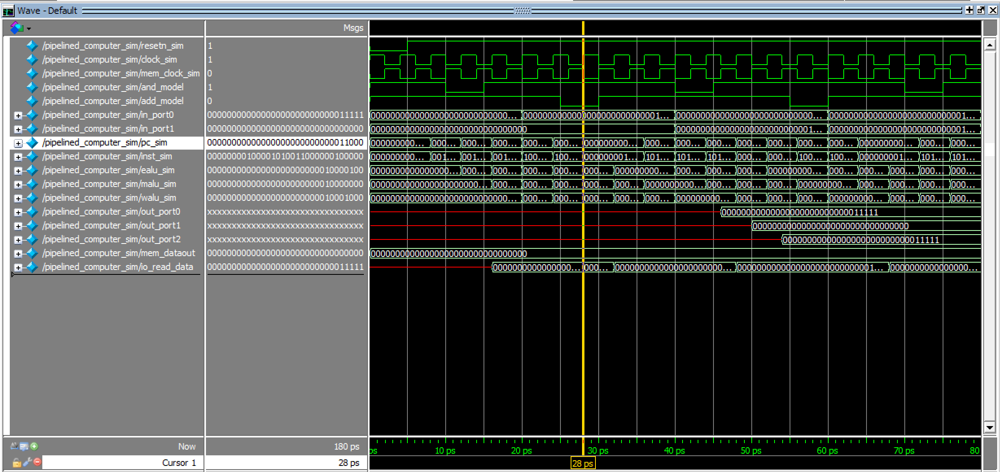

# 实验报告
## 1. 实验内容和任务
1. 理解流水线cpu
2. 掌握暂停、转发等流水线技术
3. 学会了模块化的电路编程

## 2. 实验电路


## 3. 实验步骤
1. 对单周期cpu的主电路进行了修改，将sc_cpu模块改为pipeline模块，代码来自实验书的设计。
2. 五个流水线寄存器写好，reset置0，其余赋值。
3. 实现ir、mem、wb三个模块写完，只需要在单周期的基础上修改即可，inport、outport、mem等使用单周期时的模块。
4. 写exe模块，计算alu本身与单周期时一样，无需修改，修改了数据来源
5. 实现id，采用逐步处理的思想，先确定所有input，然后确定所有output，对于每个output，想明白它是如何计算出来的，然后针对output，实现id内部的模块和连线。
6. 修改id中的cu模块，在单周期的基础上，加入转发（forward）逻辑需要的信息。
7. 仿真调试
8. 在板子上测试，汇编如下
```s
main:addi $1, $0, 128
addi $2, $0, 132
addi $3, $0, 136
addi $7, $0, 140
addi $8, $0, 144
addi $9, $0, 1
last_add:beq $9, $0, start_and
add $0, $0, $0
bne $9, $0, start_add
add $0, $0, $0
last_and:bne $9, $0, start_and
add $0, $0, $0
start_add:lw $9, 0($7)
lw $4, 0($1)
lw $5, 0($2)
add $6, $4, $5
sw $4, 0($1)
sw $5, 0($2)
sw $6, 0($3)
j last_add
add $0, $0, $0
start_and:lw $9, 0($8)
lw $4, 0($1)
lw $5, 0($2)
and $6, $4, $5
sw $4, 0($1)
sw $5, 0($2)
sw $6, 0($3)
j last_and
add $0, $0, $0
```
&emsp;&emsp;由于当第i条指令是跳转指令(jr,bne,beq,j,jal)时，无论是否跳转，第i+1条指令都会被执行，所以我们需要在每个跳转指令后面加一个延迟槽，来防止程序的执行出现错误，这里加的是`add $0, $0, $0`

## 4. 对hazard仿真
&emsp;&emsp;由于是仿真，我简化了机器码：
```
DEPTH = 128;
WIDTH = 32;
ADDRESS_RADIX = HEX;
DATA_RADIX = HEX;
CONTENT
BEGIN
0 : 20010080;  % main:addi $1, $0, 128 | 00100000000000010000000010000000 %
1 : 20020084;  % addi $2, $0, 132 | 00100000000000100000000010000100 %
2 : 20030088;  % addi $3, $0, 136 | 00100000000000110000000010001000 %
3 : 8c240000;  % add_loop:lw $4, 0($1) | 10001100001001000000000000000000 %
4 : 8c450000;  % lw $5, 0($2) | 10001100010001010000000000000000 %
5 : 00853020;  % add $6, $4, $5 | 00000000100001010011000000100000 %
6 : ac240000;  % sw $4, 0($1) | 10101100001001000000000000000000 %
7 : ac450000;  % sw $5, 0($2) | 10101100010001010000000000000000 %
8 : ac660000;  % sw $6, 0($3) | 10101100011001100000000000000000 %
9 : 08000003;  % j add_loop | 00001000000000000000000000000011 %
a : 00000020;  % add $0, $0, $0 | 00000000000000000000000000100000 %
END;
```
&emsp;&emsp;仿真文件pipelined_computer_sim中关键代码：
```
initial begin
		clock_sim = 1;
		while (1)
			#2 clock_sim = ~clock_sim;
	end
	initial begin
		mem_clock_sim = 0;
		while (1)
			#2 mem_clock_sim = ~mem_clock_sim;
	end
	initial begin
		resetn_sim = 0;
		while (1)
			#5 resetn_sim = 1;
	en
```
+ 时钟周期设为2*2=4ps，在前20ps内in_port0一直为11111，in_port1一直为00000
+ 前5ps内resetn一直为0，所以从第8ps才开始读入指令

+ 由于预期是第5行发生hazard，所以我们直接看读到第5行时的pc。读第0行是第8ps，所以读第5行是8+5*4=28ps，我们发现这里inst值为00000000100001010011000000100000，说明刚好是第5行

+ 可以看到pc和inst的值在32ps时并没有改变，在36ps时才改变，这距离28ps过了两个周期，说明这条指令被stall住了

## 5. 模块说明
&emsp;&emsp;可以说每个模块跟ppt中的图都是完全对应的


+ pipepc：该寄存器主要功能在于给IF stage提供pc4&inst的输入值
  - 模块输入：
    + npc:在IF stage中计算出的新的PC的值
    + wpcir:在ID stage中计算出的用来判断cu是否需要stall的信号
    + clock:时钟信号
  - 模块输出：
    + 输出条件：时钟信号clock处于上升沿且wpcir不为零
    + pc:传入IF stage的pc值

+ pipeir：该寄存器主要功能在于将IF stage计算得出的结果信号保存，并作为ID阶段的部分输入信号传入ID stage
  - 模块输入：
    + pc4：当前指令的下一条指令的PC，用于后续PC的计算
    + ins：用于在ID stage中进行位拆解来进行ID stage的操作和计算
    + wpcir：在ID stage中计算出的用来判断cu是否需要stall的信号
    + clock：时钟信号
  - 模块输出：
    + dpc4：即是输入的pc4
    + inst：即是输入的ins

+ pipedereg：该寄存器需要保存许多在ID stage中通过sc_cu计算得出的&一些其他的信号。在时钟信号为上升沿的时候对输出信号进行赋值并传给EXE stage
  - 模块输入：
    + dwreg：是否需要写入reg
    + dm2reg：是否需要从mem写入reg
    + dwmem：是否需要写mem
    + daluc：alu中需要执行的指令的编码
    + daluimm：alu的b操作数是否使用imm（立即数）
    + da：寄存器a中的data，用来判断beq和bne指令是否需要进行跳转
    + db：寄存器b中的data，用来判断beq和bne指令是否需要进行跳转
    + dimm：立即数中的数据
    + drn：需要写入的寄存器的编码
    + dshift：alu的a操作数是否使用移位位数
    + djal：是否执行子程序调用
    + dpc4：当前pc+4
  - 模块输出：
    + ewreg,em2reg,ewmem,ealuc,ealuimm,ea,eb,eimm,ern0,eshift,ejal,epc4

+ pipeemreg:主要将EXE stage要传给MEM stage的信号保存，并在时钟信号为上升沿的时候对输出信号进行赋值并传给MEM stage
  - 模块输入：
    + ewreg：是否需要写入reg
    + em2reg：是否需要从mem写入reg
    + ewmem：是否需要写mem
    + ealu：EXE stage中ALU的计算结果
    + eb：寄存器b中的data，用来判断beq和bne指令是否需要进行跳转
    + ern：需要写入的寄存器的编码
  - 模块输出：
    + mwreg,mm2reg,mwmem,malu,mb,mrn

+ pipemwreg:主要将MEM stage要传给WB stage的信号保存，并在时钟信号为上升沿的时候对输出信号进行赋值并传给WB stage
  - 模块输入：
    + mwreg：是否需要写入reg
    + mm2reg：是否需要从mem写入reg
    + mmo：mem中读出的内容
    + malu：EXE stage中ALU的计算结果
    + mrn：需要写入的寄存器的编码
  - 模块输出：
    + wwreg,wm2reg,wmo,walu,wrn

+ pipeif（IF）：
  - 根据IF reg传来的pc值取出相应的inst
  - 根据其他stage传来的信号计算并选择下一个pc的值并传给pc reg
    + pc选择受到pcsource（来自ID stage）的控制：
      - pcsource=0	pc=pc4（当前指令的下一条指令）
      - pcsource=1	pc=bpc（条件转移目标地址，针对beq&bne）
      - pcsource=2	pc=da（选择寄存器中的数据作为pc，针对jr）
      - pcsource=3	pc=jpc（选择跳转指令的目标地址，针对j&ja）

+ pipeid（ID）：
  - 按位分割传入的指令（inst）
  - 根据分割后的指令，用cu计算出各个控制信号,其中
    + pcsource用来判断下一条指令的pc
    + wpcir用来判断cpu是否需要stall
  - 根据分割后的指令，用regfile模块获取寄存器
  - 根据分割后的指令，用mux2x5模块选择指令选择写入的寄存器编码
  - 根据在cu中计算出的fwda&fwdb信号，利用mux4x32模块判断是否需要执行forwarding操作，若需要，根据fwda&fwdb的值选择forwarding的值写入da&db（作为EXE stage中ALU的操作数a&b）
  - 根据da&db是否相等来计算出rsrtequ，用来判断bne&beq指令是否需要跳转，用来在ID stage中用cu模块计算出pcsource
  - e为立即数扩展器，用来处理需要用到imm的指令，当符号扩展sext为1的时候做符号扩展（addi），否则做零扩展（andi&ori&xori）
  - dimm代表立即数的值
  - bpc代表beq&bne的条件跳转地址

+ pipeexe（EXE）：
  - 主要功能是根据传入的ea&eb以及指定指令的aluc在ALU模块中计算出结果，并通过ealu传递给pipeemreg，通过reg传递给MEM stage
  - 需要注意的是要判断一下inst种类是否为jal，若为jal指令，则需要把pc+8存入ealu，因为需要把pc+8作为return address，否则则把ALU的计算结果ealu0存入ealu
  - Ealuc信号控制ALU模块执行哪种指令
  - ewreg&em2reg&ewmem信号在MEM stage发挥作用，因此直接通过EXE stage转发给pipeemreg

+ pipemem（MEM）：
  - 主要功能是通过传入的数据（malu）对mem进行读/写。Mwmem信号指定是否需要写入mem（为1时需要写入，为0时不写入）
  - 通过io_input模块读入输入数据
  - 通过io_output模块输出数据到LED

+ pipewb（WB）：直接用mux2x32模块实现
  - 由wm2reg信号决定是否需要从mem写入reg，并选择数据源是wmo /walu
