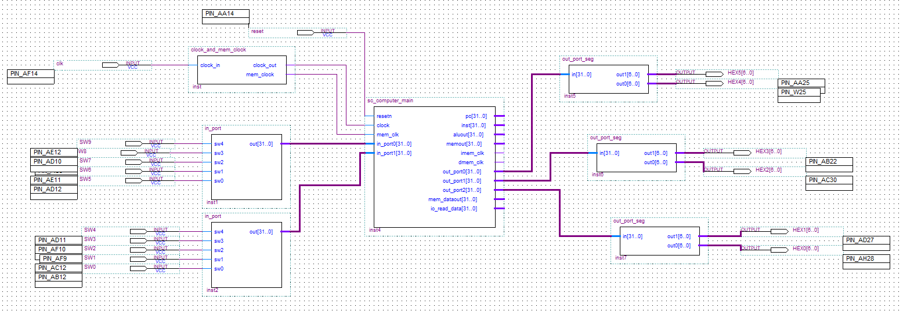

# 实验报告
## 1. 实验内容和任务：
1. 理解计算机5大组成部分的协调工作原理，理解存储程序自动执行的原理。
2. 掌握运算器、存储器、控制器的设计和实现原理。重点掌握控制器设计原理和实现方法。
3. 掌握I/O端口的设计方法，理解I/O地址空间的设计方法。 
4. 会通过设计I/O端口与外部设备进行信息交互。 

## 2. 实验电路


## 3. 我的设计
+ 先填写alu.v和sc_cu.v，完成了单周期cpu的主要功能
+ 将datamem地址分类，1开头的地址用于操作io端口，0开头用于存储数据，且因为addr是4对齐，所以通常直接取[7:2]来判断
+ 使用inport输入两个加数，使用outport展示两个加数与和，并编写加法器的汇编代码来验证正确性

#### verilog设计
```verilog
module sc_computer_main (
	resetn,clock,mem_clk,pc,inst,aluout,memout,imem_clk,dmem_clk,
	out_port0,out_port1,out_port2,in_port0,in_port1,mem_dataout,io_read_data
);
   
   input resetn,clock,mem_clk;
	input [31:0] in_port0,in_port1;
   output [31:0] pc,inst,aluout,memout;
   output        imem_clk,dmem_clk;
   output [31:0] out_port0,out_port1,out_port2;
   output [31:0] mem_dataout;            // to check data_mem output
   output [31:0] io_read_data;
   wire   [31:0] data;
   wire          wmem; // all these "wire"s are used to connect or interface the cpu,dmem,imem and so on.
   
   sc_cpu cpu (clock,resetn,inst,memout,pc,wmem,aluout,data);          // CPU module.
   sc_instmem  imem (pc,inst,clock,mem_clk,imem_clk);                  // instruction memory.
   sc_datamem  dmem (aluout,data,memout,wmem,clock,mem_clk,dmem_clk,
		out_port0,out_port1,out_port2,in_port0,in_port1,mem_dataout,io_read_data	); // data memory.

endmodule
```
&emsp;&emsp;主模块由cpu、指令存储和数据存储三部分组成

```verilog
module clock_and_mem_clock(
	clock_in,
	clock_out,mem_clock
);

	input clock_in;
	output reg clock_out; 
	output mem_clock;
	
	assign mem_clock = clock_in;
	
	initial
	begin
		clock_out <= 0;
	end
	
	always @ (posedge clock_in)
	begin
		clock_out <= ~clock_out;
	end
	
endmodule
```
&emsp;&emsp;时钟模块生成了两个信号，一个与计数器周期一致，一个周期为它的两倍，来使其异步

```verilog
module sc_cu (op, func, z, wmem, wreg, regrt, m2reg, aluc, shift,
              aluimm, pcsource, jal, sext);
   input  [5:0] op,func;
   input        z;
   output       wreg,regrt,jal,m2reg,shift,aluimm,sext,wmem;
   output [3:0] aluc;
   output [1:0] pcsource;
   wire r_type = ~|op;
   wire i_add = r_type & func[5] & ~func[4] & ~func[3] &
                ~func[2] & ~func[1] & ~func[0];          //100000
   wire i_sub = r_type & func[5] & ~func[4] & ~func[3] &
                ~func[2] &  func[1] & ~func[0];          //100010
      
   //  please complete the deleted code.
   
   wire i_and = r_type & func[5] & ~func[4] & ~func[3] &
                func[2] &  ~func[1] & ~func[0];          //100100
   wire i_or  = r_type & func[5] & ~func[4] & ~func[3] &
                func[2] &  ~func[1] & func[0];           //100101

   wire i_xor = r_type & func[5] & ~func[4] & ~func[3] &
                func[2] &  func[1] & ~func[0];           //100110
   wire i_sll = r_type & ~func[5] & ~func[4] & ~func[3] &
                ~func[2] &  ~func[1] & ~func[0];         //000000
   wire i_srl = r_type & ~func[5] & ~func[4] & ~func[3] &
                ~func[2] &  func[1] & ~func[0];          //000010
   wire i_sra = r_type & ~func[5] & ~func[4] & ~func[3] &
                ~func[2] &  func[1] & func[0];           //000011
   wire i_jr  = r_type & ~func[5] & ~func[4] & func[3] &
                ~func[2] &  ~func[1] & ~func[0];         //001000
                
   wire i_addi = ~op[5] & ~op[4] &  op[3] & ~op[2] & ~op[1] & ~op[0]; //001000
   wire i_andi = ~op[5] & ~op[4] &  op[3] &  op[2] & ~op[1] & ~op[0]; //001100
   
   wire i_ori  = ~op[5] & ~op[4] &  op[3] &  op[2] & ~op[1] &  op[0]; //001101        
   wire i_xori = ~op[5] & ~op[4] &  op[3] &  op[2] &  op[1] & ~op[0]; //001110  
   wire i_lw   =  op[5] & ~op[4] & ~op[3] & ~op[2] &  op[1] &  op[0]; //100011  
   wire i_sw   =  op[5] & ~op[4] &  op[3] & ~op[2] &  op[1] &  op[0]; //101011
   wire i_beq  = ~op[5] & ~op[4] & ~op[3] &  op[2] & ~op[1] & ~op[0]; //000100
   wire i_bne  = ~op[5] & ~op[4] & ~op[3] &  op[2] & ~op[1] &  op[0]; //000101
   wire i_lui  = ~op[5] & ~op[4] &  op[3] &  op[2] &  op[1] &  op[0]; //001111
   wire i_j    = ~op[5] & ~op[4] & ~op[3] & ~op[2] &  op[1] & ~op[0]; //000010
   wire i_jal  = ~op[5] & ~op[4] & ~op[3] & ~op[2] &  op[1] &  op[0]; //000011   
  
   assign pcsource[1] = i_jr | i_j | i_jal;
   assign pcsource[0] = ( i_beq & z ) | (i_bne & ~z) | i_j | i_jal ;
   
   assign wreg = i_add | i_sub | i_and | i_or   | i_xor  |
                 i_sll | i_srl | i_sra | i_addi | i_andi |
                 i_ori | i_xori | i_lw | i_lui  | i_jal;
   
   assign aluc[3] = i_sra;
   assign aluc[2] = i_sub | i_or | i_srl | i_sra | i_ori | i_lui;
   assign aluc[1] = i_xor | i_sll | i_srl | i_sra | i_lui;
   assign aluc[0] = i_and | i_andi | i_or | i_ori | i_sll | i_srl | i_sra;
   assign shift   = i_sll | i_srl | i_sra ;

   assign aluimm  = i_addi | i_andi | i_ori | i_xori | i_lw | i_sw | i_lui;
   assign sext    = i_addi | i_lw | i_sw | i_beq | i_bne;
   assign wmem    = i_sw;
   assign m2reg   = i_sw | i_lw;
   assign regrt   = i_addi | i_andi | i_ori | i_xori | i_lw | i_sw | i_lui;
   assign jal     = i_jal;

endmodule
```
&emsp;&emsp;控制单元读取指令，对指令的op部分和func部分进行分析得出当前cpu所处理的指令，产生并输出控制信号到cpu的各个部分

```verilog
module alu (a,b,aluc,s,z);
   input [31:0] a,b;
   input [3:0] aluc;
   output [31:0] s;
   output        z;
   reg [31:0] s;
   reg        z;
   always @ (a or b or aluc) 
      begin                                   // event
         casex (aluc)
             4'bx000: s = a + b;              //x000 ADD
				 4'bx100: s = a - b;              //x100 SUB
             4'bx001: s = a & b;					 //x001 AND
             4'bx101: s = a | b;              //x101 OR
             4'bx010: s = a ^ b;              //x010 XOR
             4'bx110: s = b << 16;		       //x110 LUI: imm << 16bit             
             4'b0011: s = $unsigned(b) << a;  //0011 SLL: rd <- (rt << sa)
             4'b0111: s = $unsigned(b) >> a;  //0111 SRL: rd <- (rt >> sa) (logical)
             4'b1111: s = $signed(b) >>> a;   //1111 SRA: rd <- (rt >> sa) (arithmetic)
             default: s = 0;
         endcase
         if (s == 0 )  z = 1;
            else z = 0;         
      end      
endmodule 
```
&emsp;&emsp;输入操作数a、b以及运算控制信号aluc，分析运算控制信号并对a和b进行对应运算，输出结果s和条件码z

#### 汇编设计
&emsp;&emsp;sc_code.s
```s
addi $1 $0 128
addi $2 $0 132
addi $3 $0 136
lw $4 $1 0
lw $5 $2 0
add $6 $4 $5
sw $4 $1 0
sw $5 $2 0
sw $6 $3 0
j 3
```

&emsp;&emsp;sc_instmem.mif
```mif
DEPTH = 16;           % Memory depth and width are required %
WIDTH = 32;           % Enter a decimal number %
ADDRESS_RADIX = HEX;  % Address and value radixes are optional %
DATA_RADIX = HEX;     % Enter BIN, DEC, HEX, or OCT; unless %
                      % otherwise specified, radixes = HEX %
CONTENT
BEGIN

0 : 20010080;        % (00) main: addi $1, $0, 128 # outport0, inport0              %
1 : 20020084;        % (04)       addi $2, $0, 132 # outport1, inport1              %
2 : 20030088;        % (08)       addi $3, $0, 136 # outport2                       %
3 : 8c240000;        % (0c) loop: lw   $4, 0($1)   # input inport0 to $4            %
4 : 8c450000;        % (10)       lw   $5, 0($2)   # input inport1 to $5            %
5 : 00853020;        % (14)       add  $6, $4, $5  # add inport0 with inport1 to $6 %
6 : ac240000;        % (18)       sw   $4, 0($1)   # output inport0 to outport0     %
7 : ac450000;        % (1c)       sw   $5, 0($2)   # output inport1 to outport1     %
8 : ac660000;        % (20)       sw   $6, 0($3)   # output result to outport2      %
9 : 08000003;        % (24)       j loop           #                                %
END ;
```
