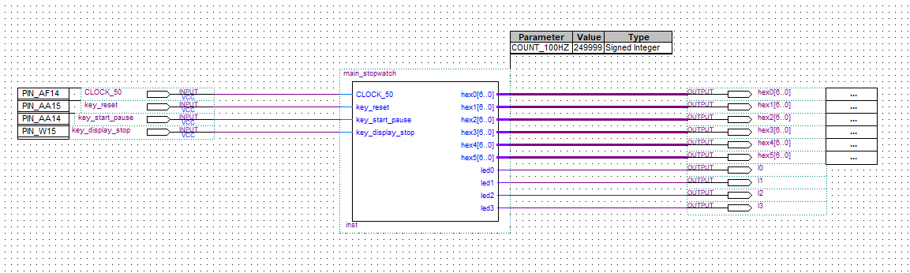

# 实验报告
## 1. 实验内容和任务：
1. 运用 Verilog 硬件描述语言，基于 DE1-SOC 实验板，设计实现一个具有较多
功能的计时秒表。
2. 要求将 6 个数码管设计为具有“分：秒：毫秒”显示，按键的控制动作有：
“计时复位”、“计数/暂停”、“显示暂停/显示继续”等。功能能够满足马拉
松或长跑运动员的计时需要。
3. 利用示波器观察按键的抖动，设计按键电路的防抖方法。
4. 在实验报告中详细报告自己的设计过程、步骤及 Verilog 代码。

## 2. 实验电路

&emsp;&emsp;stopwatch模块参考了实验指导第17页上的电路，并加入了两个消抖模块，对key_start_pause和key_display_stop进行防抖

## 3. 我的设计
&emsp;&emsp;我的设计分为三个模块，sevenseg、stopwatch、debounce
+ Sevenseg模块和书上一样负责显示管的显示转换
+ stopwatch模块转化一个100hz的时钟信号用以秒表计时，其中毫秒低位，毫秒高位，秒低位，分低位是十进制加法器，其余为6进制加法器
+ debounce模块负责防抖，参考网上的代码

&emsp;&emsp;以下为stopwatch的核心代码
```verilog 
//produce 10ms(100HZ) clock
always @ (posedge CLOCK_50)
    begin 
        if (counter_100HZ == 249999)
            begin
                counter_100HZ <= 0; // set to 0
                CLOCK_100HZ <= ~CLOCK_100HZ;
            end
        else
            begin
                counter_100HZ <= counter_100HZ + 1;
            end
    end
```
&emsp;&emsp;分出10ms的计时器

```verilog
always @ (posedge key_start_pause)
    begin
        if (!counter)
            begin
                counter_stop <= ~counter_stop;
            end
    end

always @ (posedge key_display_stop)
    begin
        if (!display)
            begin
                display_stop <= ~display_stop;
            end
    end
```
&emsp;&emsp;按下pause和display_stop时改变flag值

```verilog
always @ (posedge CLOCK_100HZ)
    begin
        //重置
        if (~key_reset)
            begin
                msecond_counter_low <= 0;
                msecond_counter_high <= 0;
                second_counter_low <= 0;
                second_counter_high <= 0;
                minute_counter_low <= 0;
                minute_counter_high <= 0;
                msecond_display_low <=0;
                msecond_display_high <= 0;
                second_display_low <= 0;
                second_display_high <= 0;
                minute_display_low <= 0;
                minute_display_high <= 0;
            end
            
        //开始进位
        if (~counter_stop )
            begin
                if (msecond_counter_low == 9)
                    begin
                        msecond_counter_low <= 0;
                        msecond_counter_high <= msecond_counter_high + 1;
                    end
                else
                    begin
                        msecond_counter_low <= msecond_counter_low + 1;
                    end
                
                if (msecond_counter_high == 10)
                    begin
                        msecond_counter_high <= 0;
                        second_counter_low <= second_counter_low + 1;
                    end
                    
                if (second_counter_low == 10)
                    begin 
                        second_counter_low <= 0;
                        second_counter_high <= second_counter_high + 1;
                    end
                    
                if (second_counter_high == 6)
                    begin
                        second_counter_high <= 0;
                        minute_counter_low <= minute_counter_low + 1;
                    end
                    
                if (minute_counter_low == 10)
                    begin
                        minute_counter_low <= 0;
                        minute_counter_high <= minute_counter_high + 1;
                    end
            end
            
        //如果没有停止展示，就更换
        if (~display_stop)
            begin
                msecond_display_low <= msecond_counter_low;
                msecond_display_high <= msecond_counter_high;
                second_display_low <= second_counter_low;
                second_display_high <= second_counter_high;
                minute_display_low <= minute_counter_low;
                minute_display_high <= minute_counter_high;
            end
    end
```
&emsp;&emsp;每10ms进行一次更新操作

## 4. 一些细节
&emsp;&emsp;我本来打算在reset时设置为counter_stop，更符合日常生活中的秒表，但是碍于verilog不同always块不能对同一reg进行赋值的设定，进行一些尝试后都失败了。
&emsp;&emsp;我又打算修改always块always @ (posedge key_start_pause or posedge key_reset)，但是报错了...所以就放弃了这个想法

